# cloud-apps-2023 &middot;   

A simple, responsive web application to take notes, built with JavaScript, designed as starting point to build complex web applications. Each application in the system can be run independently with Docker or npm. Unit, integration and end-to-end (e2e) tests are available. Development, release, integration and e2e test environments can be simulated with Docker Compose. 

This project is a modernized version of [cloud-apps](https://github.com/escobard/cloud-apps), hosted on [AWS](https://aws.amazon.com/).

## Table of contents

* [Quickstart](https://github.com/escobard/cloud-apps?tab=readme-ov-file#quickstart)
* [Usage instructions](https://github.com/escobard/cloud-apps?tab=readme-ov-file#quickstart)
* [Core Concepts](https://github.com/escobard/cloud-apps?tab=readme-ov-file#core-concepts)
* [Application docs](https://github.com/escobard/cloud-apps?tab=readme-ov-file#application-docs)
* [How to contribute](https://github.com/escobard/cloud-apps?tab=readme-ov-file#how-to-contribute)
* [Tools and frameworks](https://github.com/escobard/cloud-apps?tab=readme-ov-file#tools-and-frameworks)
* [License](https://github.com/escobard/cloud-apps?tab=readme-ov-file#license)

## Quickstart

### Recommended - Run environments with Docker Compose

[Docker](https://www.docker.com/) is required.

#### Run Development environment
`docker-compose -f dev.yaml up`

#### Run Release environment
`docker-compose -f release.yaml up`

#### Run Integration tests environment
`docker-compose -f integration-tests.yaml up --exit-code-from integration`

#### Run End to end tests environment
`docker-compose -f e2e-tests.yaml up --no-attach node-chrome --exit-code-from e2e`

#### Run Data migrations environment

`docker-compose -f migrations.yaml up`

#### Run Data tests environment

`docker-compose -f data-tests.yaml up --exit-code-from data_tests`

### Run environments with NPM and Docker Compose

[Node.js v20.9.0 or higher](https://nodejs.org/en/) and [Docker](https://www.docker.com/) are required.
        
#### Run Development environment        
 `npm run dev`            
  
#### Run Release environment        
 `npm run start`   
 
#### Run Integration tests environment

`npm run integration-tests`

#### Run End to end tests environment

`npm run e2e-tests`

#### Run Data migrations environment

`npm run migrations`

#### Run Data tests environment

`npm run data-tests`

### Run applications individually with NPM or Docker

Find detailed instructions on how to run each application within the [Application docs](https://github.com/escobard/cloud-apps?tab=readme-ov-file#application-docs).

## Usage instructions

A new note can be created in a few simple steps:

#### 1. Add note

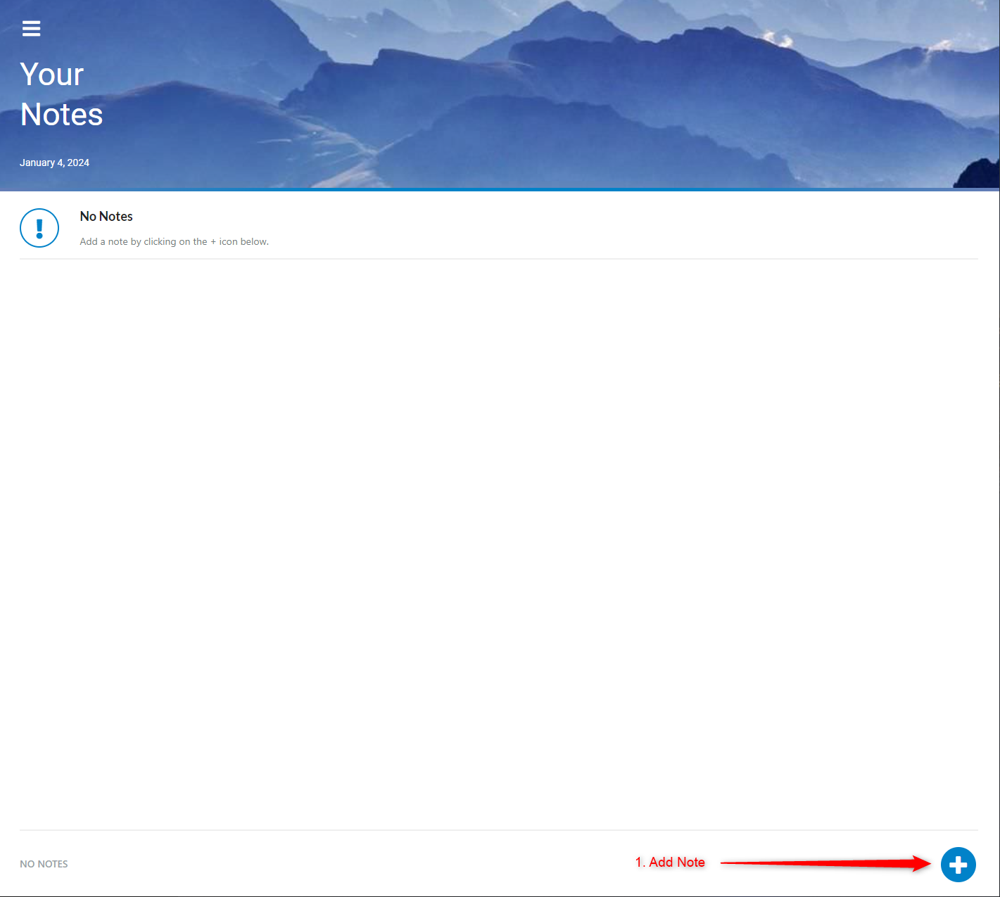

#### 2. Create and save note

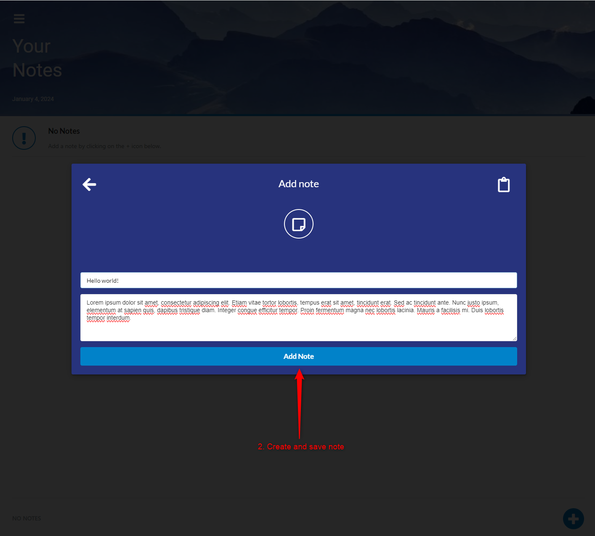

#### 3. New note created

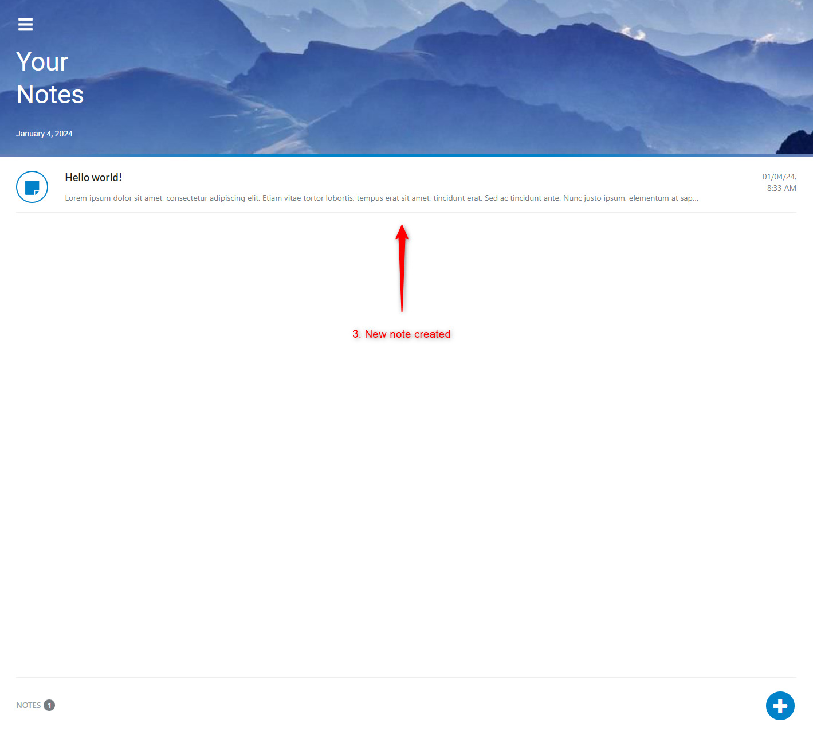

## Core concepts

As a modernized version of [cloud-apps](https://github.com/escobard/cloud-apps), this project introduces new concepts that should facilitate development for complex use cases, including:

1. [Hosted on AWS](https://github.com/escobard/cloud-apps?tab=readme-ov-file#container-orchestration-for-scale)
2. [Enterprise grade CI/CD with CircleCI](https://github.com/escobard/cloud-apps?tab=readme-ov-file#container-orchestration-for-scale)
3. [End to end tests with Playwright](https://github.com/escobard/cloud-apps?tab=readme-ov-file#container-orchestration-for-scale)
4. [Automated database migrations & tests](https://github.com/escobard/cloud-apps?tab=readme-ov-file#container-orchestration-for-scale)
5. [Lightweight dependencies for fast build and test times]()
6. [GraphQL to simplify RESTful endpoints](https://github.com/escobard/cloud-apps?tab=readme-ov-file#container-orchestration-for-scale)

In addition to the new core concepts, this project shares the same core concepts as [cloud-apps](https://github.com/escobard/cloud-apps), including:
1. [Container orchestration for scale](https://github.com/escobard/cloud-apps?tab=readme-ov-file#container-orchestration-for-scale)
2. [Automated test pyramid](https://github.com/escobard/cloud-apps?tab=readme-ov-file#automated-test-pyramid)
3. [Blueprint for automated tests with CircleCI](https://github.com/escobard/cloud-apps?tab=readme-ov-file#blueprint-for-automated-tests-with-circleci)
4. [Full stack system built with JavaScript](https://github.com/escobard/cloud-apps?tab=readme-ov-file#full-stack-system-built-with-javascript)
5. [Starting point for more complicated use cases](https://github.com/escobard/cloud-apps?tab=readme-ov-file#starting-point-for-more-complicated-use-cases)

### Hosted on AWS

The project's UI, API and Database are hosted on AWS. Leveraging [CircleCI](https://circleci.com/), the UI and API Docker images are built & deployed to AWS' [Elastic Container Registry(ECR)](https://aws.amazon.com/ecr/), then hosted with [Elastic Container Service (ECS)](https://aws.amazon.com/ecs/) and [Fargate](https://aws.amazon.com/fargate/). The database is hosted on AWS' [ Relational Database Service(RDS)](https://aws.amazon.com/rds/).

The diagram below outlines how network connections are managed between resources in AWS:

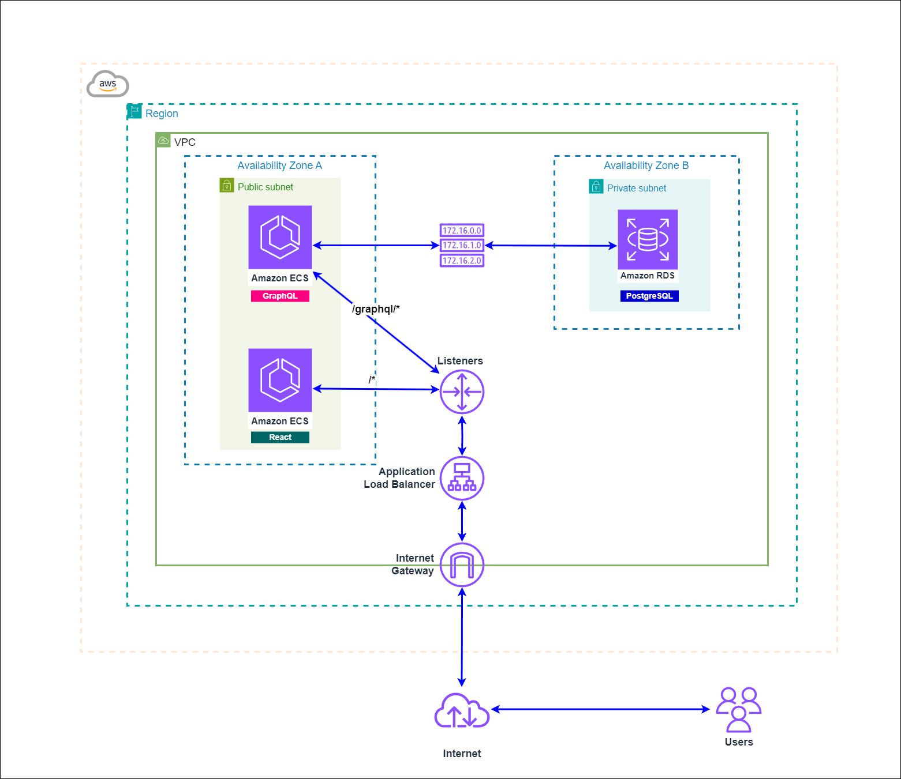

A cloud-like network can be simulated with Docker Compose. The diagram below outlines Docker Compose network connections:

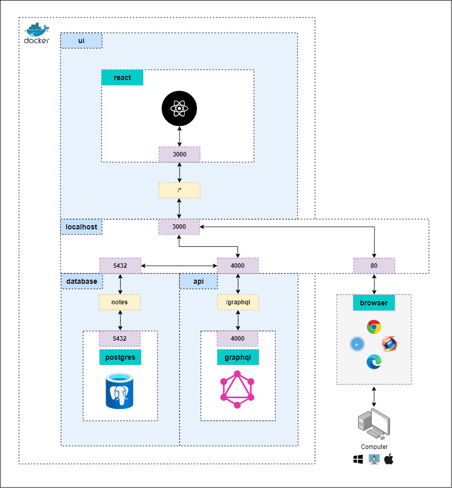

### Enterprise-grade blueprint for CI/CD with CircleCI

Unit tests for the UI, API and Database are run on every pull request to Github, using CircleCI. Once the unit tests have passed, integration tests are run, validating API and Database updates. After integration tests pass, e2e tests are run, validating that the UI, API and Database work as expected with the new updates. Once all tests have passed, the pull request can be merged to the `main` branch, which kicks off deployments.

Deployments begin by simultaneously running the jobs to build & deploy application Docker images and Database migrations. Once Docker images have been deployed to ECR, CircleCI updates ECS with the new Docker images, performing [rolling deployments](https://docs.aws.amazon.com/whitepapers/latest/overview-deployment-options/rolling-deployments.html) for the new application versions.

Following the [fail-fast automated testing approach](https://testsigma.com/blog/test-automation-achieve-fail-fast-fail-often/), the system provides a starting point (or blueprint / boilerplate) as-is for more complex automated testing requirements. The diagram below outlines how code updates are validated then deployed with Github and CircleCI:

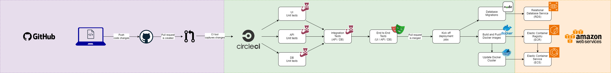

### End to end tests with Playwright

[Playwright](https://playwright.dev/) is a popular end to end testing framework, allowing developers to write tests in JavaScript, Python, Java, or .NET. Helpful tools like the [UI mode](https://playwright.dev/docs/test-ui-mode) make it easy to debug web applications in real time. 

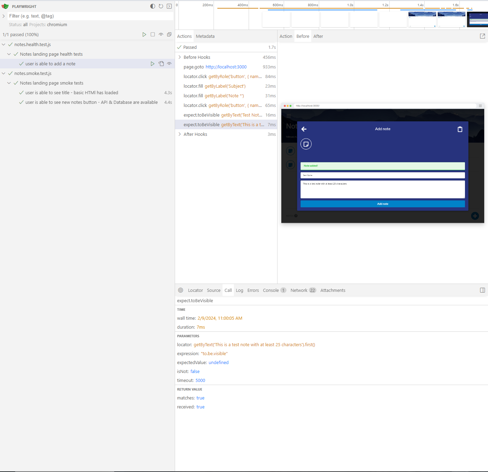

This project provides a starting point for Playwright end to end tests with JavaScript, leveraging [page object models](https://playwright.dev/docs/pom). Basic smoke and health tests are provided. To learn more, feel free to read the [end to end tests docs](https://github.com/escobard/cloud-apps/tree/master/client/tests).

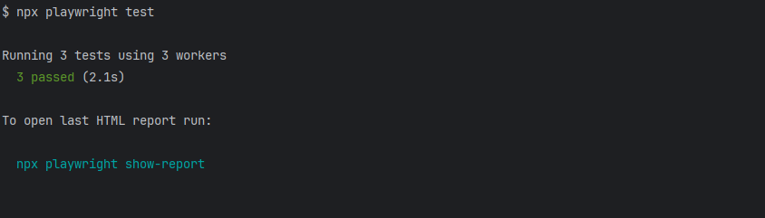

Playwright simplifies the required infrastructure to run e2e tests, since the library provides [out-of-the-box browsers ](https://playwright.dev/docs/browsers) and connects to browsers internally [without the need of a seperate hub](https://www.selenium.dev/documentation/grid/).

The diagram below outlines the simplified network created by Docker Compose, for e2e tests, including application connections, ports, routes and tools:

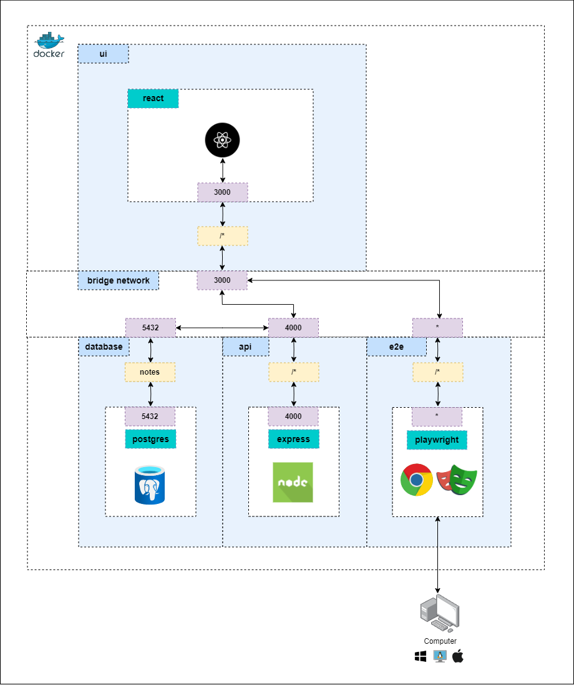

### Automated database migrations & unit tests

[Automated database migrations](https://www.prisma.io/dataguide/types/relational/what-are-database-migrations) are available to facilitate database integrity and updates with automation. 

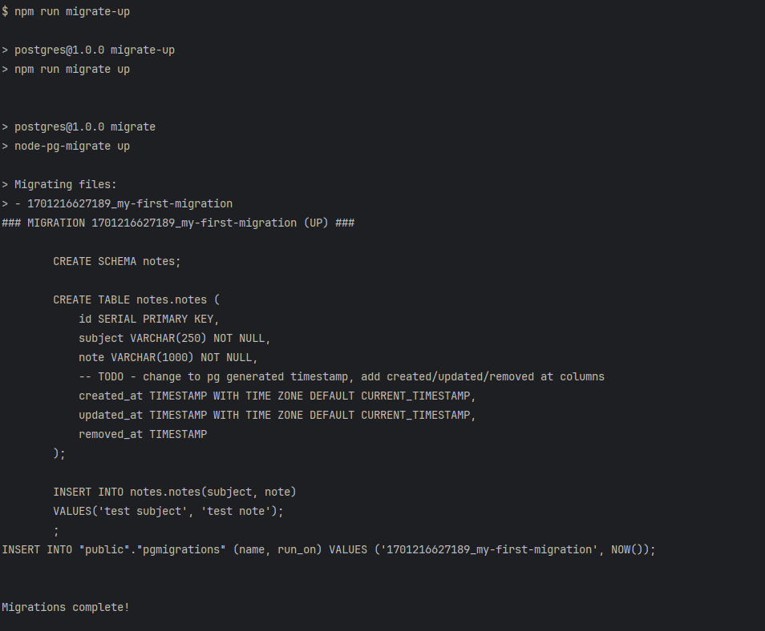

To accompany programmatic database schema and structure updates, database updates are validated with unit tests using the [Jest](https://jestjs.io/) and [pg](https://www.npmjs.com/package/pg) npm libraries. Tests are provided for health checks, migrations and common queries.

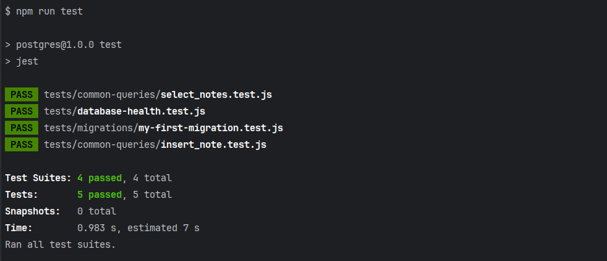

### Lightweight dependencies for fast build and test times

Build times are improved through NPM's [development only installations](https://www.warp.dev/terminus/npm-install-dev-dependencies#:~:text=To%20update%20or%20re%2Dinstall,json%20file.) , [production only installations](https://stackoverflow.com/questions/9268259/how-do-you-prevent-install-of-devdependencies-npm-modules-for-node-js-package), [CircleCI caching](https://circleci.com/docs/caching/) and Docker. Build & run times for each test application is less than a minute, with the exception of end to end tests, which install and run the entire system. 

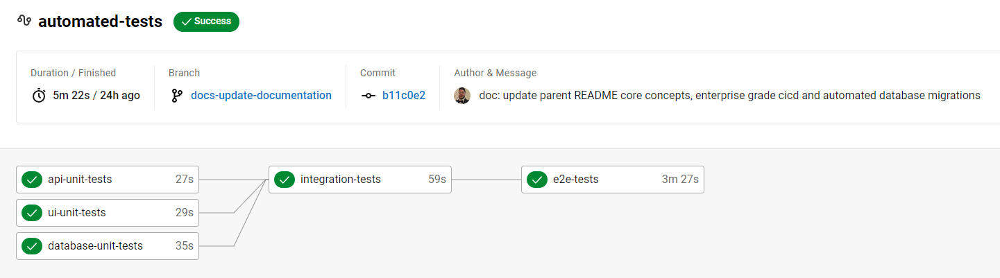

### GraphQL to simplify RESTful endpoints

[GraphQL](https://www.apollographql.com/docs/apollo-server/) is used primarily to simplify the code required to programmatically manage RESTful API endpoints and responses. [Apollo Server](https://www.apollographql.com/docs/apollo-server/) provides helpful tools to debug, and simplify maintenance of GraphQL APIs. 

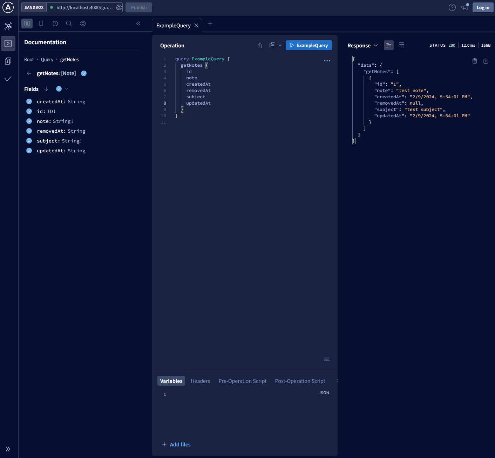

## Application docs

[UI](https://github.com/escobard/cloud-apps/blob/master/client/ui)  
[API](https://github.com/escobard/cloud-apps/blob/master/server/api)  
[Database](https://github.com/escobard/cloud-apps/tree/master/server/postgres)  
[Integration tests](https://github.com/escobard/cloud-apps/tree/master/server/tests)  
[End to end tests](https://github.com/escobard/cloud-apps/tree/master/client/tests)

## Tools and frameworks

[Node.js](https://nodejs.org/en)    
[Docker](https://www.docker.com/)   
[CircleCI](https://circleci.com)      
[AWS](https://aws.amazon.com/)   
[React](https://react.dev/)      
[Next.js](https://nextjs.org/)    
[GraphQL](https://graphql.org/)     
[Apollo Server](https://www.apollographql.com/docs/apollo-server/)   
[PostgreSQL](https://www.postgresql.org/)  
[Jest](https://jestjs.io/)  
[Supertest](https://www.npmjs.com/package/supertest)    
[Playwright](https://playwright.dev/)

## How to contribute

### Commits

Our commits follow the [Angular commit styleguide](https://gist.github.com/brianclements/841ea7bffdb01346392c). Each commit should be carefully thought out and only contain files affected within the scope of the commit message.

### Branching

A branch's name should reference a story and the type of work being committed.

### Pull Requests

Each pull request must pass a review from another contributor and all automated tests.

### Issues

Feel free to open an issue ticket, please leave a screenshot and a detailed instructions on how to replicate the issue.

## License

This repository is protected under the [MIT License](https://choosealicense.com/licenses/mit/).
